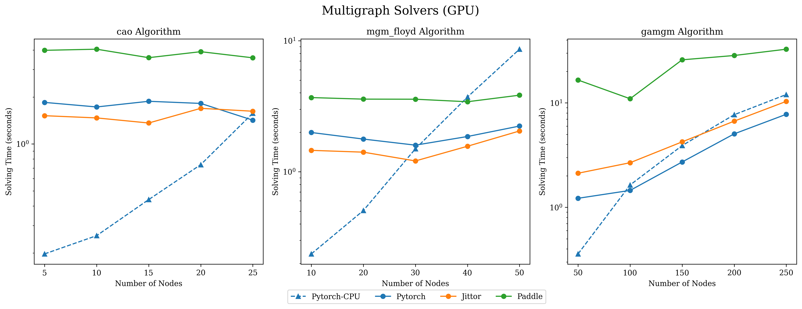

===========================
Graph Matching Benchmark
===========================

**pygmtools** also provides a protocol to fairly compare existing deep graph matching algorithms under different datasets & experiment settings.
The ``Benchmark`` module provides a unified data interface and an evaluating platform for different datasets.

If you are interested in the performance and the full deep learning pipeline, please refer to our `ThinkMatch project <https://github.com/Thinklab-SJTU/ThinkMatch>`_.

Evaluation Metrics and Results
-------------------------------------

Our evaluation metrics include **matching_precision (p)**, **matching_recall (r)** and **f1_score (f1)**.
Also, to measure the reliability of the evaluation result, we define **coverage (cvg)** for each class in the dataset
as *the number of evaluated pairs in the class/number of all possible pairs* in the class. Therefore,
larger coverage refers to higher reliability.

An example of evaluation result (``p==r==f1`` because this evaluation does not involve partial matching/outliers):

::

    Matching accuracy
    Car: p = 0.8395±0.2280, r = 0.8395±0.2280, f1 = 0.8395±0.2280, cvg = 1.0000
    Duck: p = 0.7713±0.2255, r = 0.7713±0.2255, f1 = 0.7713±0.2255, cvg = 1.0000
    Face: p = 0.9656±0.0913, r = 0.9656±0.0913, f1 = 0.9656±0.0913, cvg = 0.2612
    Motorbike: p = 0.8821±0.1821, r = 0.8821±0.1821, f1 = 0.8821±0.1821, cvg = 1.0000
    Winebottle: p = 0.8929±0.1569, r = 0.8929±0.1569, f1 = 0.8929±0.1569, cvg = 0.9662
    average accuracy: p = 0.8703±0.1767, r = 0.8703±0.1767, f1 = 0.8703±0.1767
    Evaluation complete in 1m 55s

Available Datasets
--------------------
Dataset can be automatically downloaded and unzipped, but you can also download the dataset yourself,
and make sure it in the right path.

PascalVOC-Keypoint Dataset
^^^^^^^^^^^^^^^^^^^^^^^^^^^^

#. Download `VOC2011 dataset <http://host.robots.ox.ac.uk/pascal/VOC/voc2011/index.html>`_ and make sure it looks like ``data/PascalVOC/TrainVal/VOCdevkit/VOC2011``

#. Download keypoint annotation for VOC2011 from `Berkeley server <https://www2.eecs.berkeley.edu/Research/Projects/CS/vision/shape/poselets/voc2011_keypoints_Feb2012.tgz>`_ or `google drive <https://drive.google.com/open?id=1D5o8rmnY1-DaDrgAXSygnflX5c-JyUWR>`_ and make sure it looks like ``data/PascalVOC/annotations``

#. Download the `train/test split file <https://github.com/Thinklab-SJTU/ThinkMatch/raw/master/data/PascalVOC/voc2011_pairs.npz>`_ and make sure it looks like ``data/PascalVOC/voc2011_pairs.npz``

Please cite the following papers if you use PascalVOC-Keypoint dataset:

::

    @article{EveringhamIJCV10,
      title={The pascal visual object classes (voc) challenge},
      author={Everingham, Mark and Van Gool, Luc and Williams, Christopher KI and Winn, John and Zisserman, Andrew},
      journal={International Journal of Computer Vision},
      volume={88},
      pages={303–338},
      year={2010}
    }

    @inproceedings{BourdevICCV09,
      title={Poselets: Body part detectors trained using 3d human pose annotations},
      author={Bourdev, L. and Malik, J.},
      booktitle={International Conference on Computer Vision},
      pages={1365--1372},
      year={2009},
      organization={IEEE}
    }

Willow-Object-Class Dataset
^^^^^^^^^^^^^^^^^^^^^^^^^^^^^

#. Download `Willow-ObjectClass dataset <http://www.di.ens.fr/willow/research/graphlearning/WILLOW-ObjectClass_dataset.zip>`_

#. Unzip the dataset and make sure it looks like ``data/WillowObject/WILLOW-ObjectClass``

Please cite the following paper if you use Willow-Object-Class dataset:

::

    @inproceedings{ChoICCV13,
      author={Cho, Minsu and Alahari, Karteek and Ponce, Jean},
      title = {Learning Graphs to Match},
      booktitle = {International Conference on Computer Vision},
      pages={25--32},
      year={2013}
    }

CUB2011 Dataset
^^^^^^^^^^^^^^^^^^^

#. Download `CUB-200-2011 dataset <http://www.vision.caltech.edu/visipedia-data/CUB-200-2011/CUB_200_2011.tgz>`_.

#. Unzip the dataset and make sure it looks like ``data/CUB_200_2011/CUB_200_2011``

Please cite the following report if you use CUB2011 dataset:

::

    @techreport{CUB2011,
      Title = {{The Caltech-UCSD Birds-200-2011 Dataset}},
      Author = {Wah, C. and Branson, S. and Welinder, P. and Perona, P. and Belongie, S.},
      Year = {2011},
      Institution = {California Institute of Technology},
      Number = {CNS-TR-2011-001}
    }

IMC-PT-SparseGM Dataset
^^^^^^^^^^^^^^^^^^^^^^^^^^^^

#. Download the IMC-PT-SparseGM dataset from `google drive <https://drive.google.com/file/d/1Po9pRMWXTqKK2ABPpVmkcsOq-6K_2v-B/view?usp=sharing>`_ or `baidu drive (code: 0576) <https://pan.baidu.com/s/1hlJdIFp4rkiz1Y-gztyHIw>`_

#. Unzip the dataset and make sure it looks like ``data/IMC_PT_SparseGM/annotations``

Please cite the following papers if you use IMC-PT-SparseGM dataset:

::

    @article{JinIJCV21,
      title={Image Matching across Wide Baselines: From Paper to Practice},
      author={Jin, Yuhe and Mishkin, Dmytro and Mishchuk, Anastasiia and Matas, Jiri and Fua, Pascal and Yi, Kwang Moo and Trulls, Eduard},
      journal={International Journal of Computer Vision},
      pages={517--547},
      year={2021}
    }

SPair-71k Dataset
^^^^^^^^^^^^^^^^^^^^

#. Download `SPair-71k dataset <http://cvlab.postech.ac.kr/research/SPair-71k/>`_

#. Unzip the dataset and make sure it looks like ``data/SPair-71k``

Please cite the following papers if you use SPair-71k dataset:

::

    @article{min2019spair,
       title={SPair-71k: A Large-scale Benchmark for Semantic Correspondence},
       author={Juhong Min and Jongmin Lee and Jean Ponce and Minsu Cho},
       journal={arXiv prepreint arXiv:1908.10543},
       year={2019}
    }

    @InProceedings{min2019hyperpixel,
       title={Hyperpixel Flow: Semantic Correspondence with Multi-layer Neural Features},
       author={Juhong Min and Jongmin Lee and Jean Ponce and Minsu Cho},
       booktitle={ICCV},
       year={2019}
    }

API Reference
------------------
See :doc:`the API doc of Benchmark module <../api/_autosummary/pygmtools.benchmark.Benchmark>` and
:doc:`the API doc of datasets <../api/_autosummary/pygmtools.dataset>` for details.

File Organization
------------------

* ``dataset.py``: The file includes 5 dataset classes, used to automatically download the dataset and process the dataset into a json file, and also save the training set and the testing set.
* ``benchmark.py``: The file includes Benchmark class that can be used to fetch data from the json file and evaluate prediction results.
* ``dataset_config.py``: The default dataset settings, mostly dataset path and classes.

Example
-----------

::

    import pygmtools as pygm
    from pygm.benchmark import Benchmark

    # Define Benchmark on PascalVOC.
    bm = Benchmark(name='PascalVOC', sets='train',
                   obj_resize=(256, 256), problem='2GM',
                   filter='intersection')

    # Random fetch data and ground truth.
    data_list, gt_dict, _ = bm.rand_get_data(cls=None, num=2)

Running Time Evaluation
------------------------

Overall Comparison
^^^^^^^^^^^^^^^^^^^
Charts below illustrate the results of our experimental investigation into the efficiency of some ``pygmtools`` solvers, comparing execution time among different backends and against previous packages (``ZAC_GM`` for classic solvers and ``Multiway`` for multigraph solvers).

.. Note ::
  Input affinity matrices are randomly generated with a fixed batchsize of 64 and the solving time of multigraph algorithms are evaluated upon matching 10 graphs. The execution times have been averaged across 50 runs, with the first run of each test configuration excluded to mitigate initialization biases.

Solving time on CPU
++++++++++++++++++++++
The following results were conducted on consistent CPU hardware to ensure fair comparison. To highlight, our CPU implementations of GM solvers are on-par and usually more
efficient than the open-source Octave implementation. 

Solving time on GPU
++++++++++++++++++++++
The following results were conducted on consistent GPU hardware to explore the acceleration of CUDA for graph matching problems. The speed-up brought by GPU
becomes more significant when the number of nodes grows, because the calling of GPU introduces non-negligible overhead with a smaller number of nodes. Note that log-scaled times are used for visual clarity and the dashed line labeled ``Pytorch-CPU`` acts as a baseline for 
your direct reference.

Original Results
^^^^^^^^^^^^^^^^^
Original data of our time tests are presented below.

.. Note ::
  All experiments were performed on a consistent platform of Linux Ubuntu 20.04 with Python 3.9.17 and the latest compatible versions of the numerical backends listed as follows. Runtime discrepancy shall occur due to different platform, package version, CUDA version, hardware configuration, etc.

::

  numpy==1.24.3
  torch==2.0.1
  jittor==1.3.8.5
  paddlepaddle-gpu==2.5.1.post116
  tensorflow==2.13.0
  mindspore-gpu==1.10.0

sinkhorn
+++++++++

.. table:: 

  +-----------------+------------+------------+------------+------------+-------------+
  |    Num_nodes    |    100     |    200     |    300     |    400     |    500      |
  +=================+============+============+============+============+=============+
  |      Numpy      |   0.0774   |   0.3446   |   0.8339   |   2.5503   |   2.6804    |
  +-----------------+------------+------------+------------+------------+-------------+
  |     Jittor      |   0.0949   |   0.3758   |   0.9787   |   1.8182   |   2.2302    |
  +-----------------+------------+------------+------------+------------+-------------+
  |   Jittor(gpu)   |   0.0247   | **0.0404** | **0.0579** | **0.0505** | **0.0664**  |
  +-----------------+------------+------------+------------+------------+-------------+
  |    Mindspore    |   0.6812   |    1.59    |   3.3054   |   6.1207   |   9.0556    |
  +-----------------+------------+------------+------------+------------+-------------+
  | Mindspore(gpu)  |   0.6437   |   0.9862   |   1.6007   |   2.5595   |   4.0663    |
  +-----------------+------------+------------+------------+------------+-------------+
  |     Paddle      |   0.5251   |   2.1498   |   5.1901   |   9.196    |  13.6967    |
  +-----------------+------------+------------+------------+------------+-------------+
  |   Paddle(gpu)   |   0.0516   |   0.0706   |   0.0853   |   0.0976   |   0.1299    |
  +-----------------+------------+------------+------------+------------+-------------+
  |     PyTorch     | **0.0215** |   0.0826   |   0.2163   |   0.5345   |   0.8254    |
  +-----------------+------------+------------+------------+------------+-------------+
  |  PyTorch(gpu)   |   0.0253   | **0.0536** | **0.0682** | **0.0901** | **0.1193**  |
  +-----------------+------------+------------+------------+------------+-------------+
  |   Tensorflow    |   0.2674   |   0.4068   |   0.7785   |   1.2411   |   1.3815    |
  +-----------------+------------+------------+------------+------------+-------------+
  | Tensorflow(gpu) |   0.3364   |   0.3946   |   0.3461   |   0.3532   |   0.3891    |
  +-----------------+------------+------------+------------+------------+-------------+
  | ZAC_GM(matlab)  | **0.0168** |   0.0547   |   0.085    |   0.1935   |   0.3495    |
  +-----------------+------------+------------+------------+------------+-------------+
  | ZAC_GM(octave)  |   0.4838   |   0.5544   |   0.7245   |   0.9855   |   1.3513    |
  +-----------------+------------+------------+------------+------------+-------------+

rrwm
+++++++++

.. table:: 

  +-----------------+------------+------------+------------+------------+-------------+
  |    Num_nodes    |     10     |     20     |     30     |     40     |     50      |
  +=================+============+============+============+============+=============+
  |      Numpy      | **0.0672** | **0.2686** | **0.5725** |   1.4909   |   2.6849    |
  +-----------------+------------+------------+------------+------------+-------------+
  |     Jittor      |   0.1888   |   1.4861   |   6.4132   |  19.3547   |  48.8096    |
  +-----------------+------------+------------+------------+------------+-------------+
  |   Jittor(gpu)   |   1.233    |   1.2734   |   1.367    | **1.4691** | **1.3938**  |
  +-----------------+------------+------------+------------+------------+-------------+
  |    Mindspore    |   8.996    |   9.654    |  10.4509   |  13.1224   |  15.8549    |
  +-----------------+------------+------------+------------+------------+-------------+
  | Mindspore(gpu)  |  24.4615   |  24.6842   |  26.9007   |  28.3129   |  28.6972    |
  +-----------------+------------+------------+------------+------------+-------------+
  |     Paddle      |   0.5027   |   1.0883   |   2.0557   |   4.0692   |   9.7136    |
  +-----------------+------------+------------+------------+------------+-------------+
  |   Paddle(gpu)   |   2.5013   |   5.7596   |   2.8423   |   2.4371   |   2.4668    |
  +-----------------+------------+------------+------------+------------+-------------+
  |     PyTorch     |   0.1416   | **0.3493** | **0.6419** |   1.552    |   3.0807    |
  +-----------------+------------+------------+------------+------------+-------------+
  |  PyTorch(gpu)   |   1.2784   |   1.9233   |   2.4289   | **1.4122** | **1.3357**  |
  +-----------------+------------+------------+------------+------------+-------------+
  |   Tensorflow    |   7.2743   |   7.4241   |   8.3388   |   8.7745   |  10.4648    |
  +-----------------+------------+------------+------------+------------+-------------+
  | Tensorflow(gpu) |   12.171   |  12.2908   |  13.1086   |   13.837   |   14.833    |
  +-----------------+------------+------------+------------+------------+-------------+
  | ZAC_GM(matlab)  | **0.1013** |   0.6335   |   1.6572   |   4.9238   |  15.9601    |
  +-----------------+------------+------------+------------+------------+-------------+
  | ZAC_GM(octave)  |   2.5925   |   2.9179   |   4.2427   |  16.9212   |  25.8831    |
  +-----------------+------------+------------+------------+------------+-------------+

sm
+++++++++
.. table:: 

  +-----------------+------------+------------+------------+------------+-------------+
  |    Num_nodes    |     10     |     20     |     30     |     40     |     50      |
  +=================+============+============+============+============+=============+
  |      Numpy      | **0.0005** | **0.0068** | **0.0188** |   0.0552   |   0.1289    |
  +-----------------+------------+------------+------------+------------+-------------+
  |     Jittor      |   0.0812   |   1.2849   |   6.1659   |   19.394   |  47.4565    |
  +-----------------+------------+------------+------------+------------+-------------+
  |   Jittor(gpu)   |   0.0763   |   0.0866   |   0.1207   |   0.1709   |   0.3336    |
  +-----------------+------------+------------+------------+------------+-------------+
  |    Mindspore    |   0.1917   |   0.2764   |   0.4744   |   0.813    |   1.8217    |
  +-----------------+------------+------------+------------+------------+-------------+
  | Mindspore(gpu)  |   0.6202   |   0.6836   |   0.7277   |   0.6812   |   0.9488    |
  +-----------------+------------+------------+------------+------------+-------------+
  |     Paddle      |   0.008    |   0.0117   |   0.0393   |   0.0933   |   0.2295    |
  +-----------------+------------+------------+------------+------------+-------------+
  |   Paddle(gpu)   |   0.0244   |   0.0245   |   0.0255   | **0.0388** | **0.0438**  |
  +-----------------+------------+------------+------------+------------+-------------+
  |     PyTorch     | **0.0032** | **0.0075** |   0.0266   |   0.0768   |   0.2101    |
  +-----------------+------------+------------+------------+------------+-------------+
  |  PyTorch(gpu)   |   0.0117   |   0.013    | **0.0124** | **0.0211** | **0.0295**  |
  +-----------------+------------+------------+------------+------------+-------------+
  |   Tensorflow    |   0.0621   |   0.0644   |   0.0772   |   0.1182   |   0.2152    |
  +-----------------+------------+------------+------------+------------+-------------+
  | Tensorflow(gpu) |   0.0607   |   0.0645   |   0.081    |   0.1185   |   0.1751    |
  +-----------------+------------+------------+------------+------------+-------------+
  | ZAC_GM(matlab)  |   0.0278   |   0.0465   |   0.1008   |   0.2831   |   1.0303    |
  +-----------------+------------+------------+------------+------------+-------------+
  | ZAC_GM(octave)  |   0.0979   |   0.1256   |   0.2433   |   0.5288   |   1.4496    |
  +-----------------+------------+------------+------------+------------+-------------+

cao
+++++++++
.. table:: 

  +------------------+------------+------------+------------+------------+-------------+
  |    Num_nodes     |     5      |     10     |     15     |     20     |     25      |
  +==================+============+============+============+============+=============+
  |      Numpy       | **0.0657** |   0.4048   |   1.2281   |   8.7141   |  16.6373    |
  +------------------+------------+------------+------------+------------+-------------+
  |      Jittor      |   0.1652   | **0.3034** | **0.9381** |   2.528    |   5.8438    |
  +------------------+------------+------------+------------+------------+-------------+
  |   Jittor(gpu)    |   1.5175   |   1.4686   |   1.3623   |   1.6918   |   1.621     |
  +------------------+------------+------------+------------+------------+-------------+
  |      Paddle      |   0.4363   |   0.645    |   1.1394   |   2.2024   |   4.1144    |
  +------------------+------------+------------+------------+------------+-------------+
  |   Paddle(gpu)    |   3.983    |   4.0496   |   3.5733   |   3.9038   |   3.566     |
  +------------------+------------+------------+------------+------------+-------------+
  |     PyTorch      |   0.1973   | **0.2583** | **0.4398** | **0.7367** |   1.5745    |
  +------------------+------------+------------+------------+------------+-------------+
  |   PyTorch(gpu)   |   1.8465   |   1.7263   |   1.877    |   1.819    | **1.4205**  |
  +------------------+------------+------------+------------+------------+-------------+
  | Multiway(matlab) | **0.1618** |   0.5324   |   0.9494   | **1.2673** | **1.3074**  |
  +------------------+------------+------------+------------+------------+-------------+
  | Multiway(octave) |   4.3373   |  12.7005   |  28.5129   |  32.5435   |  41.7382    |
  +------------------+------------+------------+------------+------------+-------------+

mgm_floyd
+++++++++
.. table::

  +------------------+------------+------------+------------+------------+-------------+
  |    Num_nodes     |     10     |     20     |     30     |     40     |     50      |
  +==================+============+============+============+============+=============+
  |      Numpy       |   1.4202   |   2.1465   |  13.2036   |   33.611   |  70.1147    |
  +------------------+------------+------------+------------+------------+-------------+
  |      Jittor      | **0.2715** |   2.1916   |  10.1757   |  30.9919   |  82.4783    |
  +------------------+------------+------------+------------+------------+-------------+
  |   Jittor(gpu)    |   1.4565   |   1.411    | **1.2093** | **1.5656** | **2.0477**  |
  +------------------+------------+------------+------------+------------+-------------+
  |      Paddle      |   0.5789   |   1.6008   |   4.0375   |   9.4972   |  20.0651    |
  +------------------+------------+------------+------------+------------+-------------+
  |   Paddle(gpu)    |   3.6822   |   3.5828   |   3.5775   |   3.4221   |   3.8406    |
  +------------------+------------+------------+------------+------------+-------------+
  |     PyTorch      | **0.2361** | **0.5059** | **1.4968** |   3.7183   |   8.6155    |
  +------------------+------------+------------+------------+------------+-------------+
  |   PyTorch(gpu)   |   1.9935   |   1.7762   |   1.5959   | **1.8578** | **2.2322**  |
  +------------------+------------+------------+------------+------------+-------------+
  | Multiway(matlab) |   0.5324   | **1.2673** |   1.6997   |   2.8531   |   3.8514    |
  +------------------+------------+------------+------------+------------+-------------+
  | Multiway(octave) |  12.7005   |  32.5435   |  47.9178   |   59.411   |  77.5208    |
  +------------------+------------+------------+------------+------------+-------------+

gamgm
+++++++++
.. table::

  +------------------+------------+------------+------------+------------+--------------+
  |    Num_nodes     |     50     |    100     |    150     |    200     |     250      |
  +==================+============+============+============+============+==============+
  |      Numpy       |   1.3975   |   6.4284   |  16.7187   |  37.5795   |   55.3014    |
  +------------------+------------+------------+------------+------------+--------------+
  |      Jittor      | **0.5642** |   2.4157   |   6.3132   |  13.4241   |   27.8963    |
  +------------------+------------+------------+------------+------------+--------------+
  |   Jittor(gpu)    |   2.121    |   2.6745   |   4.2369   | **6.688**  | **10.3406**  |
  +------------------+------------+------------+------------+------------+--------------+
  |      Paddle      |   1.2089   |   6.3663   |  18.9799   |  43.4897   |   74.0847    |
  +------------------+------------+------------+------------+------------+--------------+
  |   Paddle(gpu)    |  16.5545   |   10.959   |  25.8544   |  28.4271   |   32.6698    |
  +------------------+------------+------------+------------+------------+--------------+
  |     PyTorch      | **0.3582** | **1.6374** | **3.9013** |   7.7074   |   12.0233    |
  +------------------+------------+------------+------------+------------+--------------+
  |   PyTorch(gpu)   |   1.2207   | **1.4522** | **2.719**  | **5.0526** | **7.7791**   |
  +------------------+------------+------------+------------+------------+--------------+
  | Multiway(matlab) |   3.8514   |   8.8039   |  18.0332   |  23.6242   |   31.9381    |
  +------------------+------------+------------+------------+------------+--------------+
  | Multiway(octave) |  77.5208   |  208.5821  |  256.3383  |  308.7697  |  326.1246    |
  +------------------+------------+------------+------------+------------+--------------+
